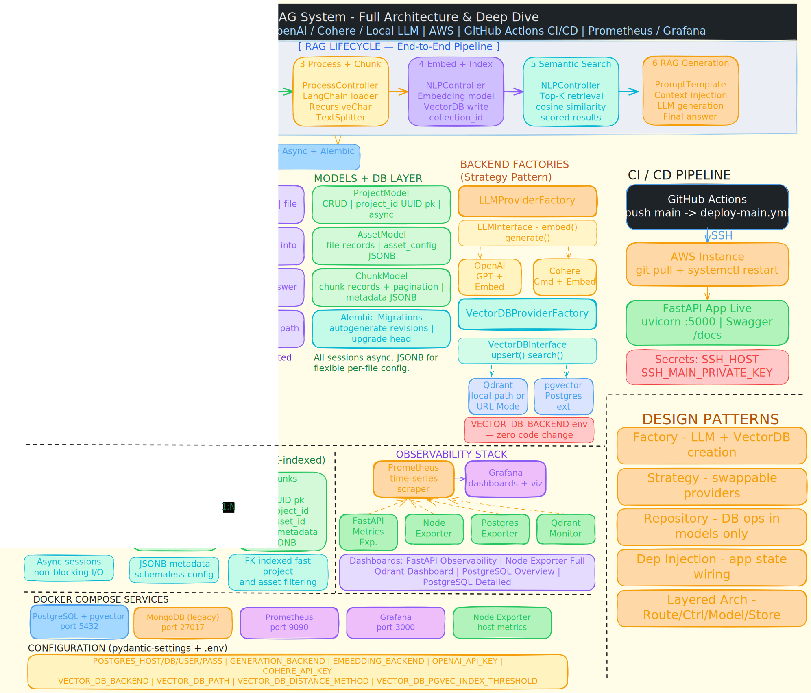
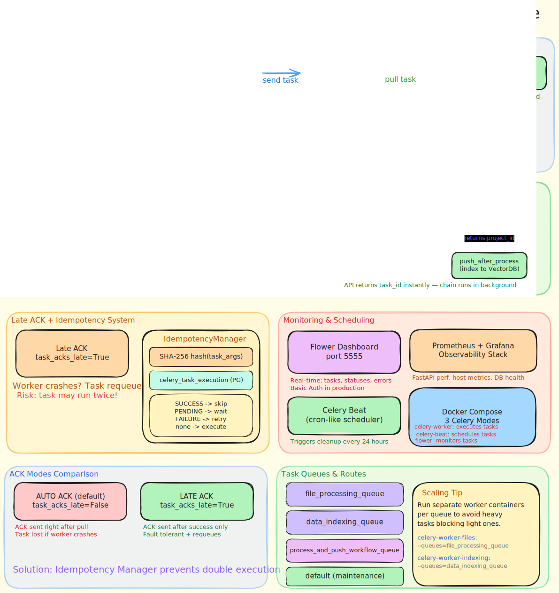
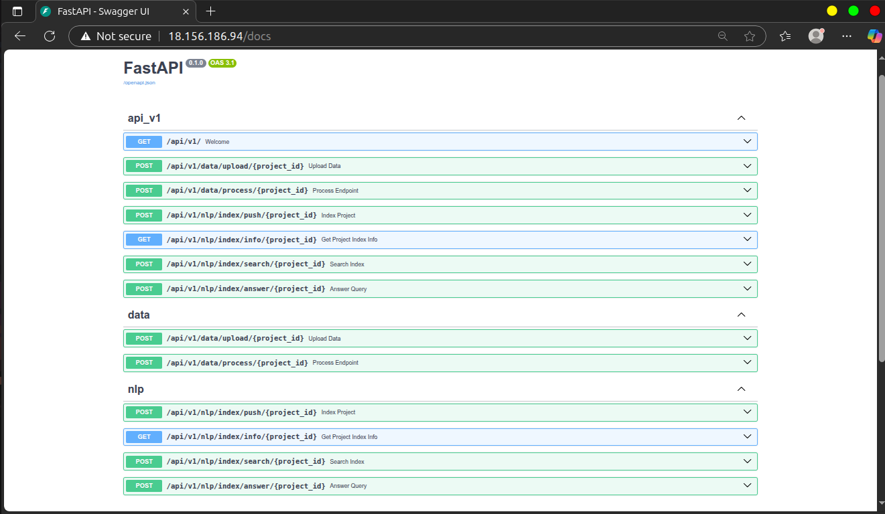
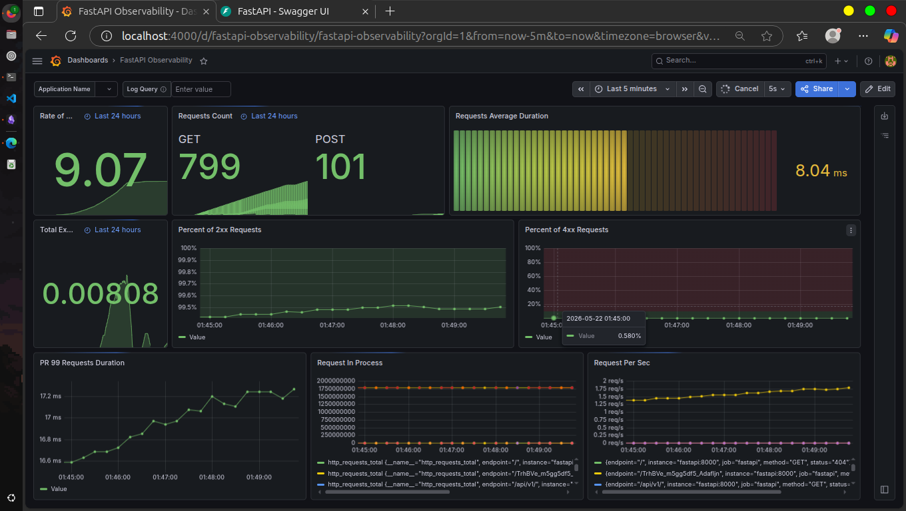
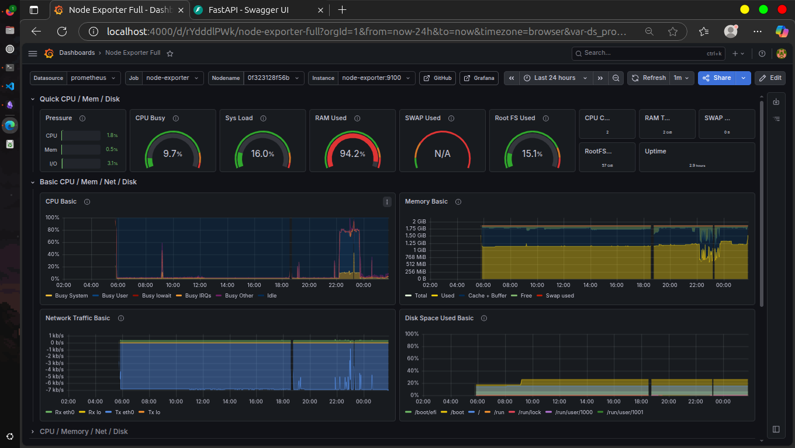
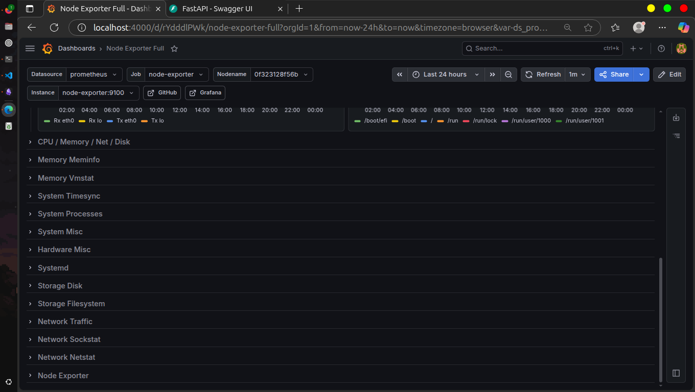
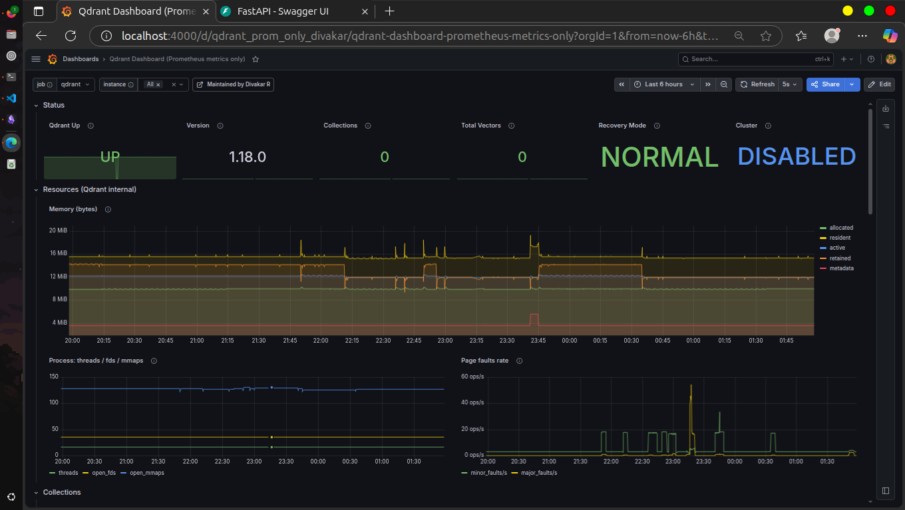
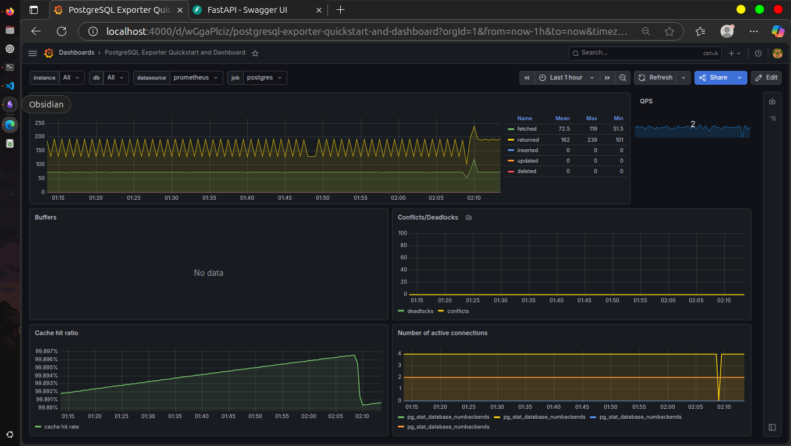
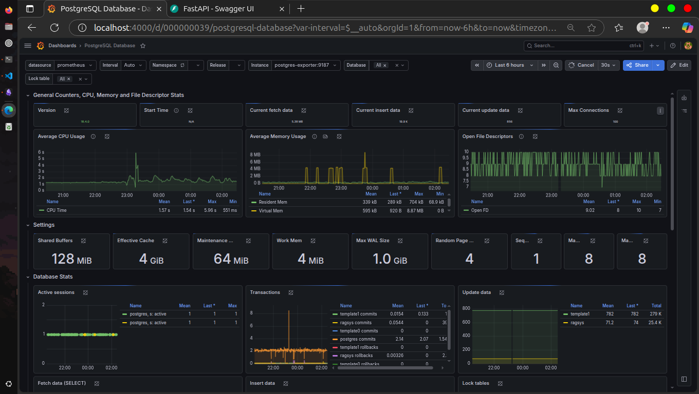
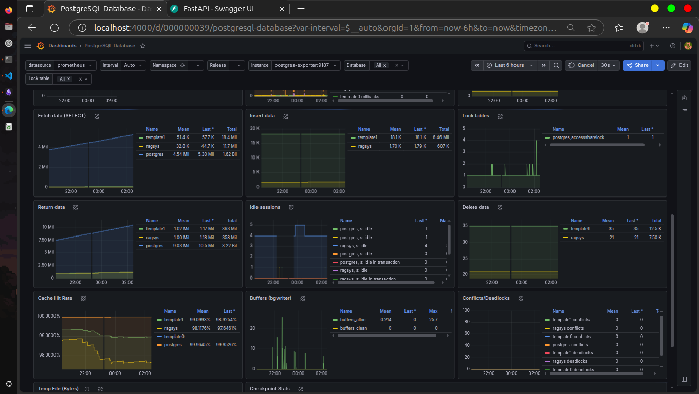

# Production RAG System 


Production RAG System is a compact, production-minded Retrieval-Augmented Generation (RAG) service built with FastAPI. It supports document upload, chunking, OCR-enhanced PDF ingestion, vector indexing, semantic search, answer generation, and Celery-backed background processing using configurable LLM, OCR, and vector backends.

This README is intentionally long and explicit. It documents how each part of the codebase works, the project flow, technologies used, design patterns, and how the architecture supports a database migration with minimal refactoring.

---


## At a Glance

- **Core goal:** upload files -> enqueue background work -> split into chunks -> index into vector DB -> search -> generate answers.
- **API-first:** FastAPI endpoints under `/api/v1`.
- **Pluggable backends:** LLM and vector DB are selected via factories and interfaces.
- **OCR-aware ingestion:** PDF pages can be read natively or sent through Gemini/Mistral OCR for image blocks.
- **Relational persistence:** PostgreSQL with SQLAlchemy + Alembic migrations.
- **Local vector storage:** Qdrant local DB path (default).
- **Background workers:** Celery workers handle long-running file processing, indexing, and workflow chaining.

---


## Project Structure (by responsibility)

```
src/
  main.py                  # app bootstrap, dependency setup
  routes/                  # HTTP layer (API)
  controllers/             # orchestration + business logic
  models/                  # data-access layer + DB schemas
  stores/                  # external services (LLM + VectorDB)
  helpers/                 # app configuration
	tasks/                   # Celery jobs for processing/indexing/maintenance
	utils/                   # Celery task tracking and idempotency helpers
  assets/                  # file uploads + local vector DB storage
```

### Routing Layer (HTTP)
- **[src/routes/base.py](src/routes/base.py)**: health/info endpoint.
- **[src/routes/data.py](src/routes/data.py)**: upload files and enqueue file processing.
- **[src/routes/nlp.py](src/routes/nlp.py)**: enqueue indexing/workflows, search, answer, and collection info.

### Controllers (Orchestration)
- **[src/controllers/DataController.py](src/controllers/DataController.py)**: file validation + file path logic.
- **[src/controllers/ProcessController.py](src/controllers/ProcessController.py)**: load file + chunking logic.
- **[src/controllers/NLPController.py](src/controllers/NLPController.py)**: indexing, search, RAG answer.
- **[src/controllers/ProjectController.py](src/controllers/ProjectController.py)**: project-specific storage paths.

### Models (Persistence)
- **[src/models/ProjectModel.py](src/models/ProjectModel.py)**: CRUD for projects.
- **[src/models/AssetModel.py](src/models/AssetModel.py)**: file asset records.
- **[src/models/ChunkModel.py](src/models/ChunkModel.py)**: chunk records + pagination.
- **[src/models/db_schemas/ragsys/schemas](src/models/db_schemas/ragsys/schemas)**: SQLAlchemy tables.

### Stores (External Services)
- **LLM providers:** OpenAI, Cohere via **[LLMProviderFactory](src/stores/llm/LLMProviderFactory.py)**.
- **OCR providers:** Gemini and Mistral via **[OCRProviderFactory](src/stores/ocr/OCRProviderFactory.py)**.
- **Vector DB providers:** Qdrant via **[VectorDBProviderFactory](src/stores/vectordb/VectorDBProviderFactory.py)**.
- **Template rendering:** prompt templates via **[TemplateParser](src/stores/llm/templates/template_parser.py)**.

---

## OCR-Enhanced PDF Ingestion

PDF loading now uses **[src/utils/PDFLoader.py](src/utils/PDFLoader.py)** as a drop-in replacement for the standard PyMuPDF loader.

How it works:

1. Each page is segmented into text blocks and image blocks.
2. Native text blocks are extracted directly and cleaned locally.
3. Image blocks are rendered to PIL images and sent to the configured OCR provider.
4. OCR output is cleaned and merged back into the page text in reading order.
5. The resulting page content is returned in the same `Document` structure expected by the rest of the pipeline.

Supported OCR backends:

- **Gemini** for multimodal extraction.
- **Mistral** for vision-capable chat extraction.

The active provider is selected with `OCR_PROVIDER`, and the corresponding API key and model name are configured through the environment.

---

## Celery Worker Architecture

The Celery work moves heavy file processing and indexing off the FastAPI request path. FastAPI acts as the producer, RabbitMQ is the broker, Celery workers execute jobs, and Redis stores task state and results.



### What was developed

The Celery work was built in two stages.

1. **Stage 1: file processing worker**
	- `POST /api/v1/data/process/{project_id}` now enqueues `tasks.file_processing.process_files` instead of processing inline.
	- The task accepts `file_id`, `chunk_size`, `chunk_overlap`, and `do_reset`.
	- It loads files from disk, splits them into chunks, and stores chunk records in PostgreSQL.
	- When `do_reset=1`, it clears the vector collection and chunk rows before rebuilding.
	- The task uses retries, late acknowledgments, and isolated async setup so it can run safely outside the web process.

2. **Stage 2: indexing workflow, scheduling, and tracking**
	- `tasks.data_indexing.index_data` pushes stored chunks into the vector DB in batches.
	- `tasks.process_and_push_workflow.process_and_push_workflow` chains file processing and indexing into one background workflow.
	- `POST /api/v1/nlp/index/push/{project_id}` starts the indexing task.
	- `POST /api/v1/nlp/index/process_and_push/{project_id}` starts the full process-then-index workflow.
	- `CeleryTaskExecution` tracks task name, task args hash, status, timestamps, Celery task id, and result.
	- `IdempotencyManager` hashes task arguments, detects duplicate work, and cleans up old task records.
	- `tasks.maintenance.cleanup_celery_executions_table` is scheduled by Celery Beat to remove stale task records.
	- Flower provides task monitoring behind basic auth.

### Celery design notes

- **Broker:** RabbitMQ receives task messages from FastAPI.
- **Result backend:** Redis stores task state and result payloads.
- **Worker queues:** dedicated queues are used for file processing, indexing, workflow chaining, and maintenance.
- **Reliability:** `task_acks_late=True`, retry policies, and task time limits reduce task loss and hanging workers.
- **Concurrency:** worker concurrency is set to 2 in the environment defaults to fit limited-resource deployments.
- **Isolation:** tasks create their own DB, LLM, and vector clients instead of reusing the web app process state.

---

## End-to-End Flow (RAG lifecycle)

### 1) Upload a file
1. HTTP request to `/api/v1/data/upload/{project_id}`.
2. `DataController.validate_uploaded_file()` verifies type and size.
3. File is persisted in `assets/files/{project_id}/`.
4. Asset metadata is stored in PostgreSQL (`assets` table).

### 2) Process files into chunks
1. HTTP request to `/api/v1/data/process/{project_id}`.
2. FastAPI enqueues a Celery task and returns a `task_id` immediately.
3. `tasks.file_processing.process_files` loads files (TXT/PDF), splits them into chunks, and stores chunk metadata in PostgreSQL (`chunks` table).
4. PDF pages are extracted with native text first, then OCR is applied to image regions when present.
5. If requested, the task also resets the related vector collection before rebuilding the chunks.

### 3) Index chunks into the vector DB
1. HTTP request to `/api/v1/nlp/index/push/{project_id}`.
2. FastAPI enqueues `tasks.data_indexing.index_data` and returns a `task_id` immediately.
3. The worker embeds chunks using the selected embedding provider.
4. Chunks are written into the configured vector DB collection in batches.

### 4) Process and push as one workflow
1. HTTP request to `/api/v1/nlp/index/process_and_push/{project_id}`.
2. FastAPI enqueues `tasks.process_and_push_workflow.process_and_push_workflow`.
3. Celery chains file processing and vector indexing so the project can rebuild both layers in one job.

### 5) Search and answer
1. HTTP request to `/api/v1/nlp/index/search/{project_id}` performs semantic search.
2. HTTP request to `/api/v1/nlp/index/answer/{project_id}` builds a RAG prompt.
3. Generation provider returns a final answer.

---

## Technologies Used

- **FastAPI**: API layer, async support, dependency injection.
- **SQLAlchemy (async)**: relational persistence layer.
- **Alembic**: schema migration and versioning.
- **Qdrant**: vector store (local path client).
- **OpenAI / Cohere**: LLM + embeddings providers.
- **LangChain**: document loading and text splitting.
- **PyMuPDF**: PDF ingestion and page/block rendering.
- **Gemini / Mistral OCR**: image-region text extraction for scanned or image-only PDF content.
- **Celery + RabbitMQ + Redis**: background task execution, queueing, and task state storage.
- **Docker Compose**: local services (Postgres with pgvector, MongoDB legacy, Celery stack).

---

## Design Patterns Used (critical)

The project intentionally uses multiple patterns to make swapping services and refactoring safe:

1) **Factory Pattern**
	- `LLMProviderFactory` and `VectorDBProviderFactory` create concrete providers from config.
	- The rest of the system depends only on the interface, not the concrete type.

2) **Strategy Pattern**
	- `LLMInterface` and `VectorDBInterface` define pluggable behaviors.
	- OpenAI/Cohere and Qdrant implementations provide interchangeable strategies.

3) **Repository / Data Access Layer**
	- `ProjectModel`, `AssetModel`, and `ChunkModel` encapsulate DB operations.
	- Routes/controllers never embed SQL details, which makes DB shifts localized.

4) **Dependency Injection via App State**
	- `main.py` wires `db_client`, `vector_db_client`, `generation_client`, `embedding_client`.
	- Controllers accept these dependencies rather than instantiating them directly.

5) **Layered Architecture (HTTP -> Controller -> Model -> Store)**
	- Clear separation of concerns reduces coupling.
	- Each layer has a narrow responsibility, enabling isolated refactors.

---

## SOLID Principles: How the Code Enforces Them

- **Single Responsibility**: Controllers orchestrate flow; models only handle persistence; providers only handle external services.
- **Open/Closed**: Adding a new LLM or vector DB is done by implementing an interface and registering in the factory.
- **Liskov Substitution**: All providers implement shared interfaces and can replace each other without breaking behavior.
- **Interface Segregation**: Separate interfaces for LLM and Vector DB keep contracts minimal and focused.
- **Dependency Inversion**: High-level controllers depend on abstractions (`LLMInterface`, `VectorDBInterface`), not concrete classes.

---

## Database Design (PostgreSQL)

**Tables (SQLAlchemy + Alembic):**

- `projects`
  - Primary entity for each logical data workspace.
- `assets`
  - Uploaded files and metadata.
- `chunks`
  - Split chunks linked to assets and projects.

**Relationships:**
- `Project` 1..N `Asset`
- `Project` 1..N `DataChunk`
- `Asset` 1..N `DataChunk`

**Highlights:**
- Uses `JSONB` for flexible metadata (`asset_config`, `chunk_metadata`).
- Indexed foreign keys for faster project/asset filtering.
- Async SQLAlchemy sessions for concurrency-safe operations.

---

## Vector Database (Qdrant and pgvector)

**Qdrant (local path mode)**
- Collection per project: `collection_{project_id}`.
- Embedding size defined by config (e.g., 1024).
- Records store: `text` + `metadata` + `score` returned by Qdrant.
- Local persistence path: `assets/database/{VECTOR_DB_PATH}`.

**pgvector (PostgreSQL extension)**
- Uses the Postgres service and keeps vector data alongside relational data.
- Ideal when you want a single database stack and simpler infra.

**Simplest switch (env-driven):**
- Set `VECTOR_DB_BACKEND` in your environment file to choose the backend.
- No code changes required; the factories resolve the provider at startup.

---

## Database Migration: MongoDB -> PostgreSQL (minimal refactor)

The codebase is structured to make a database swap mostly a **model-layer change**:

1) **DB access is isolated in models**
	- Controllers call `ProjectModel`, `AssetModel`, `ChunkModel` only.
	- SQL details never leak into routing or processing logic.

2) **Schema is managed externally via Alembic**
	- Tables and relationships are defined once in SQLAlchemy schemas.
	- Changes are tracked and migrated without rewriting business logic.

3) **Service boundaries are clean**
	- File handling, chunking, LLM calls, and vector search do not depend on the relational DB choice.

**Note:** This repo still contains MongoDB references in Docker and dependencies. They are legacy artifacts and can be removed once you are fully confident in the Postgres path.

The power of a strong software base (clean layering, interfaces, and factories) is what made the MongoDB -> PostgreSQL shift straightforward, and it now enables vector backend switching through the environment file without large refactors.

---

## Docker Compose (local services)

Docker provides multiple services:

- **PostgreSQL (pgvector image)**: main relational database (`5432`).
- **MongoDB**: legacy/experimental service (`27017`).
- **RabbitMQ**: Celery broker (`5672`) and management UI (`15672`).
- **Redis**: Celery result backend (`6379`).
- **Celery worker**: executes file processing, indexing, and workflow jobs.
- **Celery beat**: schedules periodic maintenance jobs.
- **Flower**: Celery monitoring UI (`5555`).

Use it for local development:

```bash
# create docker env files
cd docker/env
cp .env.example.app .env.app
cp .env.example.postgres .env.postgres
cp .env.example.grafana .env.grafana
cp .env.example.postgres-exporter .env.postgres-exporter

cd ..
docker compose -f docker/docker-compose.yml up -d
```

If you only use Postgres, MongoDB can be disabled.

The Celery stack expects the worker and the FastAPI app to share the same mounted asset volume so uploads, chunk files, and task outputs are visible to both processes.

---

## Alembic (Schema Migrations)

Alembic lives under:

```
src/models/db_schemas/ragsys/
```

Quick start:

```bash
cd src/models/db_schemas/ragsys
cp alembic.ini.example alembic.ini

# edit alembic.ini to set sqlalchemy.url
alembic revision --autogenerate -m "describe change"
alembic upgrade head
```

Key points:
- `alembic.ini` is local and git-ignored.
- `alembic/env.py` loads `SQLAlchemyBase.metadata` for autogenerate.

For the detailed Alembic workflow and troubleshooting notes, see
[src/models/db_schemas/ragsys/README.md](src/models/db_schemas/ragsys/README.md).

---

## Configuration (.env)

All configuration is loaded via `pydantic-settings` in **[src/helpers/config.py](src/helpers/config.py)**.

Example keys:

```
APP_NAME, APP_VERSION
POSTGRES_HOST, POSTGRES_PORT, POSTGRES_MAIN_DB, POSTGRES_USER, POSTGRES_PASSWORD
GENERATION_BACKEND, EMBEDDING_BACKEND
OPENAI_API_KEY, COHERE_API_KEY
VECTOR_DB_BACKEND_LITERALS, VECTOR_DB_BACKEND, VECTOR_DB_PATH, VECTOR_DB_DISTANCE_METHOD
VECTOR_DB_PGVEC_INDEX_THRESHOLD
GEMINI_API_KEY, GEMINI_MODEL_NAME, MISTRAL_API_KEY, MISTRAL_MODEL_NAME, OCR_PROVIDER
CELERY_BROKER_URL, CELERY_RESULT_BACKEND, CELERY_TASK_SERIALIZER, CELERY_TASK_TIME_LIMIT, CELERY_TASK_ACKS_LATE, CELERY_WORKER_CONCURRENCY, CELERY_FLOWER_PASSWORD
```

---

## API Endpoints

**Data**
- `POST /api/v1/data/upload/{project_id}`
- `POST /api/v1/data/process/{project_id}`

**NLP / Index**
- `POST /api/v1/nlp/index/push/{project_id}`
- `POST /api/v1/nlp/index/process_and_push/{project_id}`
- `GET  /api/v1/nlp/index/info/{project_id}`
- `POST /api/v1/nlp/index/search/{project_id}`
- `POST /api/v1/nlp/index/answer/{project_id}`

---

## Setup and Run

### Requirements
- Python 3.8+

### Install
```bash
sudo apt update
sudo apt install libpq-dev gcc python3-dev
pip install -r src/requirements.txt
```

### Run API
```bash
cd src
uvicorn main:app --reload --host 0.0.0.0 --port 5000
```

---

## Deployment (AWS)

The full project is now deployed on AWS and live at:

- Base URL: http://rag-sys.duckdns.org/api/v1
- Swagger UI: http://rag-sys.duckdns.org/docs

Note: This replaced the old IP URLs (http://18.156.186.94/api/v1 and http://18.156.186.94/docs).

This environment is fully operational. You can explore the routes, upload files,
index data, and test the RAG flows directly from the Swagger UI.



Key points:
- The app is deployed to an AWS instance over SSH.
- The service is restarted with `systemctl` to pick up the latest code.

---

## Observability and Monitoring

We shipped a full monitoring stack in Docker to make the system easier to operate and debug. The core idea is: FastAPI exposes metrics, Prometheus scrapes them, and Grafana visualizes the health of the app, the host, and the vector stack.

**What we monitor**
- **FastAPI API performance** (request rate, GET/POST counts, average duration, p99 duration, in-flight requests, 2xx and 4xx percent, exceptions)
- **Host metrics** via Node Exporter (CPU busy and load, RAM used, swap used, root FS used, uptime, network traffic, disk space used)
- **Qdrant health** (up status, version, collections, total vectors, recovery mode, cluster mode, memory breakdown, process threads/fds/mmaps, page fault rate)
- **PostgreSQL Exporter health** (QPS, tuples fetched/returned/inserted/updated/deleted, cache hit ratio, conflicts/deadlocks, active connections)

**PostgreSQL Database — Overview:** version & start time, current fetch/insert/update rates, max connections, CPU & memory (mean/last/max/min), open file descriptors, key server settings (shared_buffers, effective_cache, maintenance_work_mem, work_mem, max_wal_size), DB stats (active sessions, commits/rollbacks, update/insert/fetch/return/delete totals), cache hit rate and bgwriter/buffers

**PostgreSQL Database — Detailed:** per-database timeseries for fetch/insert/return/delete (mean/last/total), idle sessions and locks, cache hit rate per DB, bgwriter/buffers & checkpoint stats, conflicts/deadlocks

**Grafana dashboards**









---

## CI/CD (GitHub Actions)

The main branch is deployed using GitHub Actions:

- Workflow: [.github/workflows/deploy-main.yml](.github/workflows/deploy-main.yml)
- Trigger: push to `main`
- Deploy mechanism: SSH to the AWS instance, pull latest code, restart service

Required secrets (configured in GitHub):
- `SSH_MAIN_HOST_IP`
- `SSH_MAIN_PRIVATE_KEY`

Update these values if you change the server or user used for deployment.

---

## Why This Project is Solid

- **Layered architecture** minimizes coupling and keeps responsibilities clean.
- **Strict contracts** via interfaces reduce risk when swapping providers.
- **Async DB and I/O** for scalability and non-blocking performance.
- **Background task isolation** keeps long-running file and indexing work off the request path.
- **Task tracking and idempotency** make Celery retries and periodic cleanup safe.
- **Schema migration discipline** with Alembic keeps data evolution safe.
- **Config-driven behavior** makes environment and vendor changes predictable.


